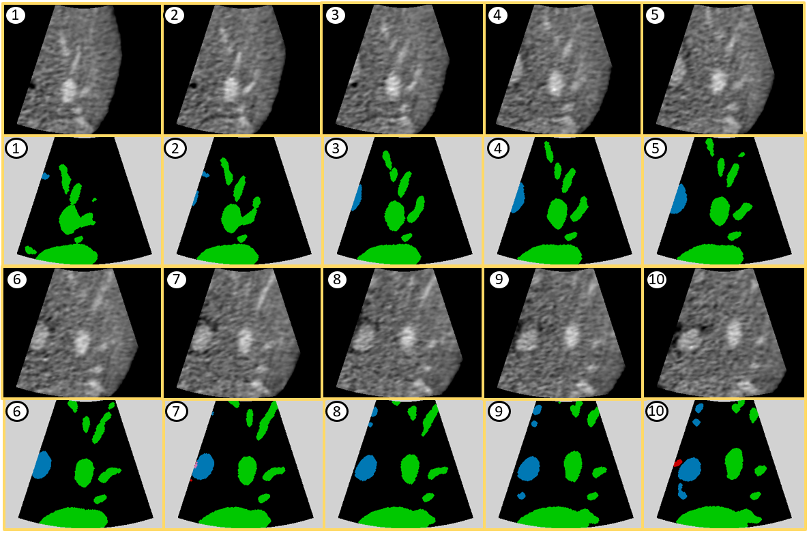
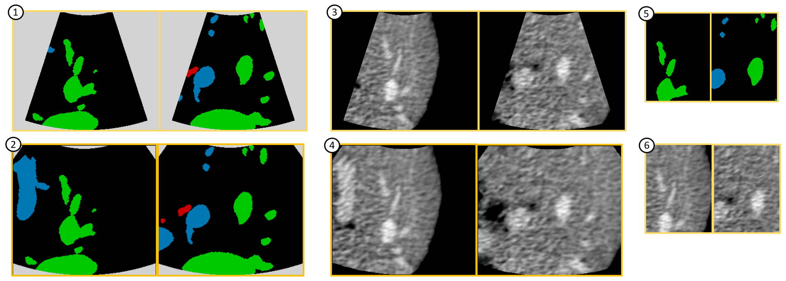

USER GUIDE
===============================
Sections below describe how to use and parameterise the plane sampling.

Binary and Non-binary volumes
^^^^^^^^^^^^^^^^^^^^^^^^^^^^^

For **non-binary volumes**, instantiate an object of the class ``IntensityVolume`` in *pycuda_simulation/intensity_volume.py*

::

    IntensityVolume(config_dir, vol_dir, image_num, downsampling, file_type, npy_config)

* ``config_dir`` is a *.json* file with image parameters (described in the next section).
* ``vol_dir`` is the directory with the volume data to be sliced. Currently three different formats are supported and defined  by ``file_type``: *npy* for .npy, *nii* for .nii, *dicom* for DICOM.  An additional config file ``npy_config`` is needed for the ``npy`` option.
* ``image_num`` is the number of simulated images per run. For improved speed, should be kept the same across runs.
* ``downsampling`` is an integer for downsampling of the resulting 2D images.

For **binary volumes**, instantiate an object of the class ``SegmentedVolume`` in *pycuda_simulations/segmented_volume.py*

::

    SegmentedVolume(mesh_dir, config_dir, image_num, downsampling, voxel_size)

* ``config_dir``, ``image_num`` and ``downsampling`` are the same as for ``IntensityVolume``. However, ``config dir`` holds specific information on the surfaces to be intersected.
* ``mesh_dir`` is the directory with the surfaces from which a binary volume will be generated and sampled. Currently, only *.vtk* is supported. The user can adapt any other file as long as a mesh structure as the one defined in *pycuda_simulation/mesh.py* is generated.
* ``voxel_size`` is the isotropic voxel size of the generated binary volume. If *.npy* files with the same name as the *.vtk* surfaces do not exist on ``mesh_dir``, the method ``voxelise_mesh`` is used to generate the respective isotropic binary volume.

For **both volume objects**, (defined as ``volume``) image sampling is done by calling

::

        volume.simulate_image(pose, image_num, out_points)

* ``pose`` is a 4x4 matrix holding the plane poses (rotation and translation) that are to be sampled. Pose parameterisation is described below.
* ``image_num`` is the number of poses/images to be generated.
* ``out_points`` is a flag to decide whether the plane sampling 3D coordinates are extracted or not.
* For ``IntensityVolume``, an array of ``image_num`` grayscale images are returned.
* For ``SegmentedVolume``, two arrays are output: one with RGB images where colors are given to each of the intersected surface (colors defined in ``config_dir``), and one with grayscale images where each intersected surface has a different integer value.

Curvilinear (Fan) Plane parameters
^^^^^^^^^^^^^^^^^^^^^^^^^^^^^^^^^^

.. image:: fan_shapes.png
   :width: 600

Fig. 1 - Left: Fan-shape parameters. Right: Plane pose parameters.

To control the fan shape images, three sets of parameters must be defined in ``config_dir``:

* ``fan_geometry``, set of 6 parameters defining the fan shape and sampling in 2D.

    * *dtheta*: resolution of angular sampling of the fan, in **degrees**.
    * *da*: the depth line resolution, in **millimeters**
    * *theta*: the total fan aperture, in **degrees**.
    * *a*: the total depth line length starting from the curvature centre *O*, in **pixels**.
    * *c*: the depth of the fan, i.e the length of the fan line, in **pixels**.
    * *b*: the offset between the image rectangle and the fan line origin (the transducer contact point), in **pixels**.

* ``image_dimensions``, 2 integers, the size of the rectangle where the fan image is displayed (*w* and *h*).
* ``pixel_dimensions``, 2 floats, the 2D resolution of the final image.

To define a new configuration, the user must calculate these parameters and adjust ``image_dimensions`` so that the fan lies neatly inside the simulated image.

4x4 matrices should be in agreement with the frame of reference in the right side of Fig. 1, as in the matrix below:

.. image:: pose_matrix.png
   :width: 150

Linear (Rectangle) Plane parameters
^^^^^^^^^^^^^^^^^^^^^^^^^^^^^^^^^^^

To simulate rectangular images, change the ``transducer_type`` from *curvilinear* to *linear*. In this case, only 2 sets of parameters are needed:

* ``image_dimensions``, 2 integers, the size of the rectangular image.
* ``pixel_dimensions``, 2 floats, the 2D resolution of the image.

The reference of these planes is similar to the curvilinear case, but *P* is **located at the top left corner of the plane**.

Demo examples
^^^^^^^^^^^^

The script *simulation_demo.py* displays a basic example of usage of both classes ``SegmentedVolume`` and ``IntensityVolume``
to simulate 10 images through the following steps:

1 - Create an instance of ``SegmentedVolume``. This step generates binary volumes, and allocates the GPU arrays necessary for sampling:

::

    liver_volume = svol.SegmentedVolume(config_dir="config/models_binary_LUS_config.json",
                                        mesh_dir="data/",
                                        voxel_size=0.5,
                                        downsampling=2,
                                        image_num=10)

* ``image_num=10`` defines that 10 images are to be generated every time the method *simulate_image* is called.
* ``mesh_dir="data/"`` defines the directory from where to load surfaces.
* ``voxel_size=0.5`` defines the resolution of the binary volumes generated from the loaded surfaces.
* ``downsampling=2`` represents an inverse rescaling on the final generated images (divides dimensions by 2 in this case).

2 - Create an instance of ``IntensityVolume``. This step loads a 3D volume, and allocates the GPU arrays necessary for sampling:

::

    ct_volume = ivol.IntensityVolume(config_dir="config/models_intensity_LUS_config.json",
                                     vol_dir="data/CT_test_volume.npy",
                                     file_type="npy",
                                     npy_config="config/CT_npy_volume_config.json",
                                     downsampling=2,
                                     image_num=10)

* ``image_num=10`` and ``downsampling=2`` have the same effect as in the ``SegmentedVolume`` above.
* ``vol_dir="data/CT_test_volume.npy"`` defines the location of the 3D volumetric image to be loaded.
* ``file_type="npy"`` determines that the loaded volume is a *.npy* file.
* For the the *.npy* extension, a ``npy_config`` file with the 3D voxel size and bounding box of the volume in **millimiters**

3 - Generate a set of evenly spaced poses:

* An initial ``pose`` with size (4, 4) that is aligned to the volumes is first hardcoded.
* The pose is then repeated horizontally, to yield an array ``poses`` of 10 poses  with size (4, 40).
* The third row entry at the last column of each (4, 4) array is incremented with 2, creating an even spacing of 2 millimeters across the out-of-plane axis (z-axis).
* **Automatic pose definition** is **not included** in this package.

4 - Generate images from both volumes:

::

    points, binary_map, colored_map = \
        liver_volume.simulate_image(poses=poses, image_num=10)

    points, ct_map = \
        ct_volume.simulate_image(poses=poses, image_num=10)

* ``points`` hold an array with zeros, as ``output_points`` is ``False`` by default. Otherwise, a (N, 3) sized array with simulated plane coordinates is obtained. The i'th imaging plane coordinates can be obtained by indexing the array ``points[:, (i - 1) * N/image_num:i * N/image_num]``.
* ``binary_map`` is a 3D array with a stack of 10 sliced 2D binary images. ``colored_map`` shows the same result with colors, and therefore has 4 dimensions.
* ``ct_map`` is a 3D array with a stack of 10 sliced 2D intensity images.

Fig. 2 displays the expected outputs ``ct_map`` and ``colored_map``.

Fig. 2 - Image pairs generated by the *simulation_demo.py* script.

Test examples
^^^^^^^^^^^^^^^^^^^

Examples of multiple configurations with curvilinear and linear arrays are used in the tests of *tests-pycuda/test_pycuda_simulations.py*.
Three geometries with both binary and non-binary volumes are tested:

* *tests-pycuda/config/binary_config_1.json*, the same binary configuration as in *simulation_demo.py*. Tested in ``test_binary_image_sim``, and outputs image pair 1 in Fig. 3.
* *tests-pycuda/config/binary_config_2.json*, a different binary curvilinear geometric configuration with a larger fan. Tested in ``test_binary_image_sim``, and outputs image pair 2 in Fig. 3.
* *tests-pycuda/config/intensity_config_1.json*, the same non-binary configuration as in *simulation_demo.py*. Tested in ``test_intensity_image_sim``, and outputs image pair 3 in Fig. 3.
* *tests-pycuda/config/intensity_config_2.json*, a different non-binary curvilinear geometric configuration with a larger fan. Tested in ``test_intensity_image_sim``, and outputs image pair 4 in Fig. 3.
* *tests-pycuda/config/linear_config.json*, a linear array configuration. Tested in ``test_linear_probe_sim``, and outputs image pairs 5 and 6 in Fig. 3.

Fig. 3 - Image pairs generated by the *simulation_demo.py* script.

Further Usage
^^^^^^^^^^^^^

Current code version is compatible with Pytorch and Tensorflow CUDA allocation as long as the GPU Compute Exclusive Mode is disabled.
